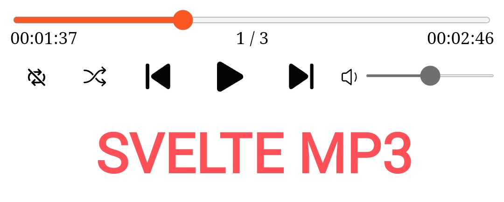

# Svelte-mp3



This is a light blazingly fast yet simple minimalistic audio playervfor svelte.

## Installation
    npm install --save svelte-mp3

## Quickstart
Inside any *.svelte file:
  ```svelte
    <script>
      import {AudioPlayer} from 'svelte-mp3';
    </script>
    //...
    <AudioPlayer 
      urls=['url or src of an audio1','url or src of an audio2']
    />
  ```
  
  ## Props
  Prop | Type | Default | Notes
--- | --- | --- | ---
`class` | String | empty string | Any global class name for styling your player
`color` | String | 'black' | coloring the outlines and buttons
`disableVolSlider`  | Boolean | false | Removes volume control slider if true 
`loop`  | 'repeat-all', 'repeat', 'no-repeat' | 'no-repeat' | playback same audio every time or all audio in a loop.
`showNext`  | Boolean | true  | hides next button if false.
`showPrev`  | Boolean | true  | hides previous button if false.
`showTime`  | Boolean | true  | display current time and duration of an audio.
`showTrackNum`  | Boolean | true  | display currently playing track number.
`showShuffle` | Boolean | true  | display shuffle button if true.
`showVolume`  | Boolean | true  | display speaker icon and volume control slider if true.
`shuffle` | Boolean | true  | playback random track number if true.
`style` |  String | empty string  | ---
`urls`  | String [] | []  | array of audio source/url
`volume`  | Number  | 1 | value between 0 to 1.

## API
name  | type |  default | desc  |
--- | --- | --- | --- |
isPlaying| writable store Boolean  | false | a global writable svelte store for checking and setting audio playback.
trackIndex |  writable store number | 0 | currently playing track number.
state | writable store  'repeat-all', 'repeat', 'no-repeat' | 'no-repeat' | looping values.
PlayIcon  | svelte component |   |    | 
  PauseIcon | svelte component |   |    |
PreviousIcon  | svelte component |   |    |
NextIcon  | svelte component |   |    |
ShuffleIcon | svelte component |   |    |
RepeatIcon  | svelte component |   |    |
RepeatOnceIcon  | svelte component |   |    |
NoRepeatIcon | svelte component |   |    |

With global stores you can import them from any svelte component to configure audio player.